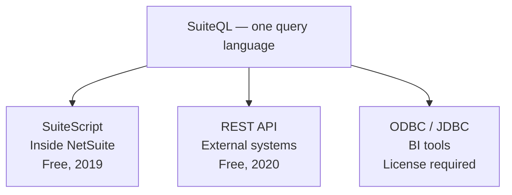

# BrokenRubik<br/>Slidev theme

The official brand theme — dark-first, opinionated, and ready to ship.

<div class="mt-10 flex items-center gap-3 text-brand-muted">
  <Kbd>Space</Kbd>
  <span>to continue</span>
</div>

<!--
Opening slide. `cover` layout — black background, BR logo on top, big title.
-->

---
layout: intro
---

<Eyebrow>Who should use it?</Eyebrow>

# Any BrokenRubik deck.

Client presentations, internal decks, conference talks — this theme replaces whatever starter you were going to tweak.

<div class="grid grid-cols-2 gap-4 mt-8 text-base">
  <DotItem color="secondary"><strong>Dark-first</strong> — black canvas, Aspekta type</DotItem>
  <DotItem color="secondary"><strong>Locked brand</strong> — colors and type enforced</DotItem>
  <DotItem color="primary"><strong>8 layouts</strong> — for every section of a deck</DotItem>
  <DotItem color="primary"><strong>17 components</strong> — for every common pattern</DotItem>
</div>

---
layout: section
eyebrow: "Foundations"
---

# Colors, type, tone

---

# Brand colors

<div class="grid grid-cols-3 gap-4 mt-8">
  <div class="rounded overflow-hidden">
    <div class="bg-primary h-28 flex items-end p-4">
      <div class="text-white font-bold text-2xl">Primary</div>
    </div>
    <div class="px-4 py-2 font-mono text-xs text-brand-muted bg-brand-faint">#9547FF</div>
  </div>
  <div class="rounded overflow-hidden">
    <div class="bg-secondary h-28 flex items-end p-4">
      <div class="text-black font-bold text-2xl">Secondary</div>
    </div>
    <div class="px-4 py-2 font-mono text-xs text-brand-muted bg-brand-faint">#DFF95F</div>
  </div>
  <div class="rounded overflow-hidden">
    <div class="bg-accent h-28 flex items-end p-4">
      <div class="text-black font-bold text-2xl">Accent</div>
    </div>
    <div class="px-4 py-2 font-mono text-xs text-brand-muted bg-brand-faint">#FF707A</div>
  </div>
</div>

<div class="mt-8 text-xs text-brand-muted uppercase tracking-widest">Opacity modifiers</div>
<div class="grid grid-cols-4 gap-2 mt-2">
  <div class="h-8 rounded bg-primary/80"></div>
  <div class="h-8 rounded bg-primary/50"></div>
  <div class="h-8 rounded bg-primary/25"></div>
  <div class="h-8 rounded bg-primary/10"></div>
</div>
<div class="grid grid-cols-4 gap-2 mt-2 font-mono text-xs text-brand-muted">
  <div>bg-primary/80</div>
  <div>bg-primary/50</div>
  <div>bg-primary/25</div>
  <div>bg-primary/10</div>
</div>

---

# Typography

<div class="mt-6 space-y-4">
  <div>
    <div class="text-xs uppercase tracking-widest text-brand-muted mb-1">Display — Aspekta 700</div>
    <div class="text-5xl font-bold">The quick brown fox</div>
  </div>
  <div>
    <div class="text-xs uppercase tracking-widest text-brand-muted mb-1">Heading — Aspekta 600</div>
    <div class="text-3xl font-semibold">Jumps over the lazy dog</div>
  </div>
  <div>
    <div class="text-xs uppercase tracking-widest text-brand-muted mb-1">Body — Aspekta 400</div>
    <div class="text-xl">Sphinx of black quartz, judge my vow.</div>
  </div>
  <div>
    <div class="text-xs uppercase tracking-widest text-brand-muted mb-1">Mono — Fira Code</div>
    <code class="text-xl">const theme = '@brokenrubik'</code>
  </div>
</div>

---
layout: section
eyebrow: "Layouts"
---

# Reusable layouts

---
layout: statement
---

# A single sentence can own the whole screen.

<!-- `layout: statement` — centered, white text on black, no distractions. -->

---
layout: fact
---

# 150+

Projects delivered since 2017

<!-- `layout: fact` — huge number, tiny caption. Built for stats. -->

---
layout: quote
author: "Anonymous client"
role: "NetSuite admin"
---

We went from Saved Searches that hit their limits to SQL that answers **every question** finance can throw at us.

---
layout: two-cols-header
---

<Eyebrow>Layout</Eyebrow>

# Two columns with header

A shared title spans both columns — then parallel content below.

::left::

<div class="pr-6 pt-6">

<Eyebrow color="primary">Before</Eyebrow>

### Saved Searches

- Point-and-click interface
- One level of joins
- ~5,000 row cap
- Dashboard portlets

</div>

::right::

<div class="pl-6 pt-6 border-l border-brand-border">

<Eyebrow color="secondary">After</Eyebrow>

### SuiteQL

- Standard SQL syntax
- Unlimited table joins
- 100,000 rows via API
- Powers integrations

</div>

---
layout: three-cols-header
---

<Eyebrow>Layout</Eyebrow>

# Three columns with header

Three parallel ideas under a shared title — ideal for plans, phases, or option sets.

::left::

<div class="pt-6 pr-4">

<div class="text-5xl font-extrabold text-primary leading-none mb-3">01</div>

### Plan

Scope the work, list the SuiteQL queries, and pick an owner for delivery.

</div>

::center::

<div class="pt-6 px-4 border-l border-r border-brand-border">

<div class="text-5xl font-extrabold text-secondary leading-none mb-3">02</div>

### Build

Write the queries, then wire them into SuiteScript or hit the REST endpoint.

</div>

::right::

<div class="pt-6 pl-4">

<div class="text-5xl font-extrabold text-accent leading-none mb-3">03</div>

### Ship

Replace one painful Saved Search, measure the impact, and repeat.

</div>

---
layout: section
eyebrow: "Components"
---

# Branded components

---

<Eyebrow>Callout</Eyebrow>

# Colored banners for emphasis

<Callout type="primary" class="mt-6">
  <strong>Primary</strong> — default emphasis. Use for core takeaways.
</Callout>

<Callout type="secondary" class="mt-3">
  <strong>Secondary</strong> — positive reinforcement, tips, success states.
</Callout>

<Callout type="accent" class="mt-3">
  <strong>Accent</strong> — warnings, risks, things to be careful about.
</Callout>

---

<Eyebrow>Card</Eyebrow>

# Grouped content with a frame

<div class="grid grid-cols-3 gap-4 mt-6">
  <Card type="primary" title="SuiteScript">
    The fastest path. Inside NetSuite, free, since 2019.
  </Card>
  <Card type="secondary" title="REST API">
    External systems over HTTP. Free, since 2020.
  </Card>
  <Card type="accent" title="ODBC / JDBC">
    For BI tools. Separate license required.
  </Card>
</div>

<div class="grid grid-cols-2 gap-4 mt-4">
  <Card title="Muted">A neutral card — good for options where none is dominant.</Card>
  <Card title="Muted">Uses a faint background and border. No color weight.</Card>
</div>

---

<Eyebrow>Step · DotItem</Eyebrow>

# Steps and colored bullets

<div class="grid grid-cols-2 gap-10 mt-6">
<div>

<Step :n="1">Install the npm package</Step>
<Step :n="2">Set the theme in your headmatter</Step>
<Step :n="3">Run <code>slidev</code> and start writing</Step>

</div>
<div>

<DotItem color="primary"><strong>Primary</strong> — the default direction of attention</DotItem>
<DotItem color="secondary"><strong>Secondary</strong> — a metric or success marker</DotItem>
<DotItem color="accent"><strong>Accent</strong> — a warning or divergence</DotItem>

</div>
</div>

---

<Eyebrow>Stat</Eyebrow>

# Static stats row

<div class="grid grid-cols-4 gap-6 mt-12">
  <Stat value="2019" label="Available since" color="secondary" />
  <Stat value="Free" label="Included license" color="secondary" />
  <Stat value="100K" label="Rows per query" color="primary" />
  <Stat value="0" label="Risk — read-only" color="accent" />
</div>

---
layout: section
eyebrow: "Code"
---

# Code, diagrams & tables

---

<Eyebrow>Code</Eyebrow>

# Syntax highlighting

```ts
interface Customer {
  id: number
  name: string
  active: boolean
}

async function fetchCustomers(): Promise<Customer[]> {
  const res = await fetch('/api/customers')
  if (!res.ok) throw new Error(`HTTP ${res.status}`)
  return res.json()
}
```

Shiki with <code>houston</code> for dark, <code>github-light</code> for light mode.

---

<Eyebrow>SuiteQL</Eyebrow>

# A real-world SQL example

```sql
SELECT
    BUILTIN.DF(Transaction.Entity) AS Customer,
    SUM(CASE WHEN (TRUNC(SYSDATE) - Transaction.DueDate) < 1
        THEN TransactionAccountingLine.AmountUnpaid ELSE 0 END) AS Current_Balance,
    SUM(CASE WHEN (TRUNC(SYSDATE) - Transaction.DueDate) BETWEEN 1 AND 30
        THEN TransactionAccountingLine.AmountUnpaid ELSE 0 END) AS Days_1_30
FROM Transaction
INNER JOIN TransactionAccountingLine
    ON TransactionAccountingLine.Transaction = Transaction.ID
WHERE Transaction.Posting = 'T'
GROUP BY BUILTIN.DF(Transaction.Entity)
```

<Callout type="secondary" class="mt-4 text-sm">
Inline <code>code</code> picks up the brand palette automatically.
</Callout>

---

<Eyebrow>Data</Eyebrow>

# Tables

| Tool           | Joins       | Subqueries | Result cap |
| -------------- | ----------- | ---------- | ---------- |
| Saved Searches | One level   | No         | ~5,000     |
| **SuiteQL**    | Unlimited   | Yes        | 100,000    |
| Workbook       | Multi-level | Limited    | Variable   |

Tables inherit brand colors — header on primary tint, hover on primary low-alpha.

---

<Eyebrow>Diagram</Eyebrow>

# Mermaid integration

<div class="flex justify-center mt-6">



</div>

<div class="mt-4 text-sm text-brand-muted text-center">
Mermaid auto-inherits the BR palette via the theme's mermaid setup.
</div>

---
layout: section
eyebrow: "Interactions"
---

# Animations & marks

---

<Eyebrow>Click animations</Eyebrow>

# Reveal content on space

<div class="mt-6 text-lg text-brand-muted">

Press <Kbd>Space</Kbd> to reveal each point — v-click and v-mark primitives compose naturally with every theme component.

</div>

<div class="mt-6">

<v-clicks>

- First point appears on the first click
- Then the second point
- Then the <span v-mark.underline.purple="3">third one</span>, with a rough underline
- And finally, this one

</v-clicks>

</div>

<Callout type="primary" class="mt-8" v-click>
All standard Slidev animation primitives work — <code>v-click</code>, <code>v-clicks</code>, <code>v-mark</code>, <code>v-drag</code>.
</Callout>

---
layout: section
eyebrow: "Richer components"
---

# Built for presentation patterns

---

<Eyebrow>Compare</Eyebrow>

# Side-by-side columns

<Compare leftLabel="Saved searches" rightLabel="SuiteQL" class="mt-6">
  <template #left>

  - Point-and-click interface
  - One level of joins
  - ~5,000 row limit
  - Dashboard portlets

  </template>
  <template #right>

  - Standard SQL syntax
  - Unlimited table joins
  - 100,000 rows via API
  - Powers integrations

  </template>
</Compare>

---

<Eyebrow>Timeline</Eyebrow>

# Evolution stories

<Timeline class="mt-6">
  <TimelineItem when="2019" color="primary">
    SuiteQL officially launched via SuiteScript
  </TimelineItem>
  <TimelineItem when="2020" color="primary">
    REST API support — external systems can query NetSuite
  </TimelineItem>
  <TimelineItem when="2024" color="secondary">
    Workbook can export datasets as SuiteQL
  </TimelineItem>
  <TimelineItem when="2025" color="secondary">
    SuiteQL adopted as the standard across the platform
  </TimelineItem>
  <TimelineItem when="2026" color="accent">
    Legacy NetSuite.com data source completely removed
  </TimelineItem>
</Timeline>

---

<Eyebrow>Pros · Cons</Eyebrow>

# Branded checkmark lists

<div class="grid grid-cols-2 gap-4 mt-6">
<Pros title="What SuiteQL unlocks">

- Unlimited table joins
- Subqueries and UNIONs
- GL-level accounting data
- 100K rows per query

</Pros>
<Cons title="What Saved Searches can't">

- Multi-level joins
- Subqueries
- GL-level data
- Large dataset pulls

</Cons>
</div>

---

<Eyebrow>Pill</Eyebrow>

# Inline status labels

<div class="flex flex-wrap gap-2 mt-6">
  <Pill color="primary">Primary</Pill>
  <Pill color="secondary">Free</Pill>
  <Pill color="secondary">Since 2019</Pill>
  <Pill color="accent">Deprecated</Pill>
  <Pill color="muted">Read-only</Pill>
</div>

<div class="mt-8 text-lg">

Works inline too — NetSuite <Pill color="secondary">2024.1+</Pill> adds workbook export <Pill color="muted">beta</Pill> with parameterized queries <Pill color="accent">breaking change</Pill>.

</div>

---

<Eyebrow>Tool</Eyebrow>

# Integration grid

<div class="grid grid-cols-3 gap-3 mt-6">
  <Tool name="Celigo" note="Native SuiteQL + JDBC" logo="https://www.celigo.com/favicon.ico" href="https://www.celigo.com" />
  <Tool name="Workato" note="Execute SuiteQL action" logo="https://www.workato.com/favicon.ico" href="https://www.workato.com" />
  <Tool name="n8n" note="Community nodes" logo="https://n8n.io/favicon.ico" href="https://n8n.io" />
  <Tool name="Power BI" note="Via ODBC connector" logo="https://learn.microsoft.com/favicon.ico" />
  <Tool name="Tableau" note="Via ODBC connector" logo="https://www.tableau.com/favicon.ico" />
  <Tool name="Postman" note="Official collection" logo="https://www.postman.com/favicon.ico" />
</div>

<div class="mt-4 text-sm text-brand-muted">
Missing a logo? <code>&lt;Tool&gt;</code> falls back to a first-letter badge automatically.
</div>

---

<Eyebrow>Checklist</Eyebrow>

# Actionable next steps

<Checklist class="mt-6">

- Install Tim Dietrich's Query Tool in your sandbox
- Browse the Records Catalog to learn available tables
- Try the AI Connector with a question in plain English
- Pick one painful Saved Search and port it to SuiteQL

</Checklist>

---

<Eyebrow>Metric</Eyebrow>

# Animated counters

<div class="grid grid-cols-3 gap-8 mt-10">
  <Metric value="$4.2M" label="Revenue (Q1)" delta="+18%" trend="up" color="secondary" animate />
  <Metric value="3.1" label="Days to close" delta="-22%" trend="down" color="primary" animate />
  <Metric value="98.4%" label="API uptime" delta="0.1pp" trend="flat" color="secondary" animate />
</div>

<div class="grid grid-cols-3 gap-8 mt-10">
  <Metric value="150" label="Projects delivered" animate />
  <Metric value="2017" label="Founded" color="primary" animate :from="2010" />
  <Metric value="24" label="Senior team coverage" color="accent" animate />
</div>

<div class="mt-6 text-sm text-brand-muted">
Pass <code>animate</code> to count up on slide enter. Override <code>:from</code>, <code>:duration</code> for custom pacing.
</div>

---

<Eyebrow>Plan</Eyebrow>

# Pricing comparison

<div class="grid grid-cols-3 gap-4 mt-6">

<Plan
  name="Starter"
  currency="$"
  price="0"
  period="/mo"
  description="For solo operators trying things out."
  cta="Start free"
>

- Up to 3 seats
- 1 GB storage
- Community support
- ~~Priority SLA~~

</Plan>

<Plan
  name="Pro"
  currency="$"
  price="29"
  period="/mo"
  description="For teams running real workloads."
  cta="Start 14-day trial"
  ctaHref="https://brokenrubik.co"
  highlight
>

- Unlimited seats
- 100 GB storage
- Priority support
- AI Connector included

</Plan>

<Plan
  name="Enterprise"
  price="Custom"
  description="For regulated teams with heavy compliance needs."
  cta="Talk to sales"
  ctaHref="https://brokenrubik.co"
  color="accent"
>

- Dedicated environment
- SSO + audit log
- Named support engineer
- Custom SLA

</Plan>

</div>

---

<Eyebrow>Kbd</Eyebrow>

# Keyboard keys

<div class="grid grid-cols-2 gap-x-10 gap-y-2 mt-6 text-base">
  <div><Kbd>Space</Kbd> / <Kbd>→</Kbd> — next step</div>
  <div><Kbd>Shift</Kbd> + <Kbd>Space</Kbd> — previous step</div>
  <div><Kbd>O</Kbd> — overview</div>
  <div><Kbd>D</Kbd> — dark mode toggle</div>
  <div><Kbd>G</Kbd> — go-to slide</div>
  <div><Kbd>F</Kbd> — fullscreen</div>
</div>

---
layout: end
url: https://brokenrubik.co
---

# Ready to present.

<div class="text-xl mt-4 text-brand-muted">
Drop <code>theme: '@brokenrubik/slidev-theme-brokenrubik'</code> into your headmatter and go.
</div>
